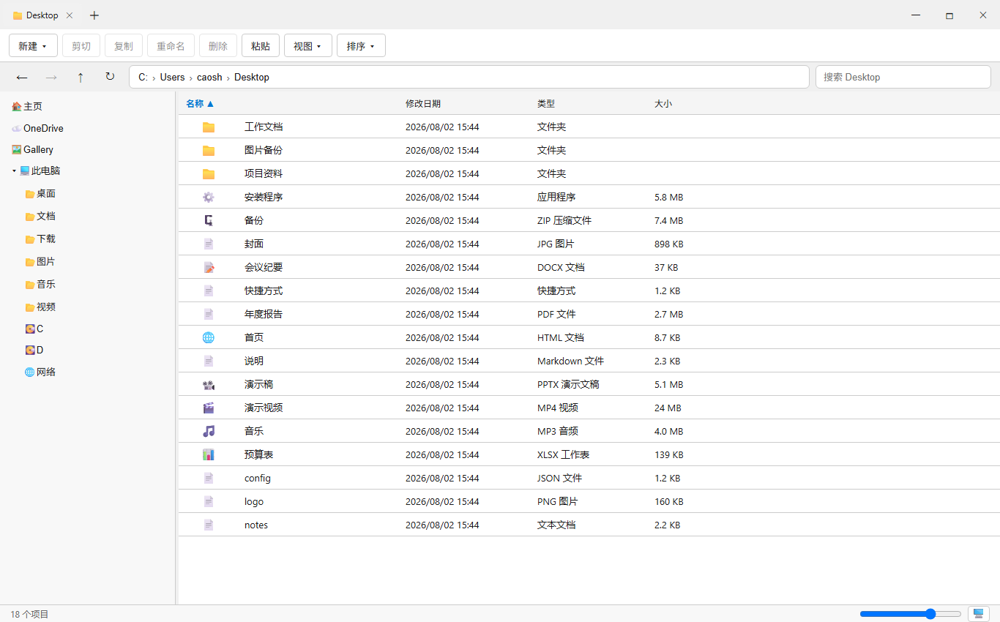

# Lepton Explorer

一个高度还原 **Windows 11 文件资源管理器** 的应用，基于 **Tauri v2**（Rust 后端）+ **React + TypeScript** 构建。支持 Windows 10 与 Windows 11。

  

## 功能简介

一款完全可用、在布局与交互上对齐 Win11 资源管理器的文件管理器：

- **8 种视图模式** — 特大 / 大 / 中 / 小图标、列表、详细信息、平铺、内容
  （通过「视图 ▾」下拉、状态栏滑块、`Ctrl+Shift+1–8`，或 `Ctrl+滚轮` 切换）
- **导航** — 面包屑（分段点击 + 编辑模式）、此电脑 + 快速访问导航窗格、
  后退/前进/向上、刷新（`F5`）、`Backspace`=后退、`Alt+←/→/↑`（后退/前进/向上）、
  地址栏聚焦（`Ctrl+L`/`Alt+D`/`F4`，带**路径自动补全**）、窗格聚焦循环（`F6`/`Shift+F6`）、
  **主页**（含特殊文件夹 + 最近文件）、**相册** / **网络** / **OneDrive** 根节点
- **标签页** — `Ctrl+T`/`W`/`Tab`/`1–9`，中键点击文件夹=在新标签页打开，中键点击标签页=关闭，
  拖拽重排，右键菜单「在新标签页中打开」
- **多窗口** — `Ctrl+N` 新建窗口，`Ctrl+W` 关闭（最后一个标签页/窗口会退出应用）
- **文件操作** — 新建文件夹/文件，重命名（`F2`，行内编辑），复制（带**可取消的进度对话框**），
  剪切/粘贴（递归、跨盘符，冲突时弹出**替换/跳过/保留两者对话框**），
  删除到回收站（可通过 `Ctrl+Z` **撤销**），永久删除（`Shift+Del`），用默认应用打开，
  **撤销/重做**（`Ctrl+Z`/`Y`）
- **ZIP 压缩 / 解压** — 右键「压缩为 ZIP」/「解压到文件夹」，可取消进度，
  解压带 **Zip-Slip 防护**，目标名自动编号（冲突安全 `(n)` 后缀）
- **打开方式** — 「打开方式」对话框枚举已注册应用（注册表）+「查找其他应用」
  （系统原生选择器）
- **按文件夹记忆视图** — 每个文件夹记住自己的视图模式、排序字段/方向，
  以及列宽（持久化到应用数据目录）
- **选择** — 单击 / `Ctrl` / `Shift` / `Ctrl+A`，方向键导航（`↑↓`+`Enter`），
  图标视图下支持橡皮筋框选
- **丰富特性** — 图片缩略图 + 系统文件类型图标（`SHGetFileInfo`）、**实时文件监视**
  （自动刷新）、**右键上下文菜单**（`Shift+F10`）+ **「显示更多选项」**
  （通过 COM 调用真正的 Windows 外壳 `IContextMenu`）、**搜索**（`Ctrl+E`/`F`）、**属性**
  （`Alt+Enter`）、**预览窗格**（`Alt+P`）+ **详细信息窗格**（`Alt+Shift+P`）
- **快速访问** — 固定/取消固定文件夹（持久化），跨窗口同步
- **外观** — 自定义 Mica 标题栏，浅色/深色主题（跟随系统），`F11` 全屏，
  视图→显示开关（隐藏的项目 / 文件扩展名），详细信息列宽可调、排序箭头、显示/隐藏列、分组依据

## 截图

<p align="center">
  
  <br><sub>主页视图 —— 特殊文件夹（桌面、文档、下载、图片……）与最近文件</sub>
</p>

<p align="center">
  
  <br><sub>文件夹视图 —— 详细信息布局，含可排序列（名称、类型、大小、修改日期）</sub>
</p>

<p align="center">
  
  <br><sub>文件夹视图 —— 平铺布局</sub>
</p>

## 构建与运行

### 环境准备

- **Windows 10 / 11**
- **Rust** 工具链，MSVC 目标 — `rustup default stable-x86_64-pc-windows-msvc`
- **Node.js 20+** 与 **pnpm**
- **WebView2 运行时**（Windows 11 预装；Windows 10 可能需要手动安装）
- 带有 *使用 C++ 的桌面开发* 工作负载的 **Visual Studio 生成工具**（提供 `cargo` 构建 Tauri 原生二进制所需的
  链接器 / Windows SDK）

### 安装依赖

```bash
pnpm install          # 一次性安装
```

### 开发

```bash
pnpm tauri dev
```

会先运行 `beforeDevCommand`（`pnpm dev` → Vite，地址 http://localhost:1420），以 debug 模式编译 Rust 后端，
等待开发服务器就绪后打开应用窗口。首次构建需要编译所有 Rust 依赖，可能耗时数分钟；
后续构建为增量，速度很快。

### 发布构建

```bash
pnpm tauri build
```

生成经过优化的原生二进制及安装包：

- 独立 exe — `src-tauri/target/release/lepton-explorer.exe`
- MSI 安装包 — `src-tauri/target/release/bundle/msi/*.msi`
- NSIS 安装包 — `src-tauri/target/release/bundle/nsis/*-setup.exe`

## 测试与类型检查

```bash
cd src-tauri && cargo test --lib   # Rust 单元测试（59 通过，9 忽略）
pnpm test                          # 前端测试（165 通过）
pnpm exec tsc --noEmit             # TypeScript 类型检查（0 错误）
```

## 架构

```
Rust 后端 (src-tauri/src/)            前端 (src/)
  lib.rs          命令入口 + run()        App.tsx          外壳 + 快捷键 + 接线
  fs_ops.rs       列表/搜索/文件夹大小     state/           locationStore(标签页), viewStore
  ops.rs          创建/复制/移动/删除                      (文件夹覆盖), selectionStore,
                   + 冲突策略                            clipboardStore, historyStore,
                   + 受监控进度                         searchStore, pinnedStore,
  zip.rs           ZIP 压缩/解压                         recentStore, tagStore,
                   (Zip-Slip 防护, 可取消)                conflictStore, progressStore
  open_with.rs    打开方式 (注册表)      hooks/           useDirectory, useFileOps
  folder_views.rs 按文件夹记忆视图       components/      TitleBar, TabBar, Toolbar,
  special.rs      特殊文件夹/盘符                          Breadcrumb, NavPane, CommandBar,
  network.rs      网络 (WNet)                            FileList + 8 种视图, ContextMenu,
  gallery.rs      相册 (图片/视频)                        OpenWithDialog, PropertiesDialog,
  shell_menu.rs   真实外壳 IContextMenu                  PreviewPane, ProgressModal,
  watch.rs        实时文件系统监视                         ConflictModal, …
  thumbnails.rs   图片缩略图 + 图标
  office.rs       类型化文件 (docx/xlsx/pptx)
  error.rs        AppError (serde {kind,msg})
```

所有文件系统访问都封装在类型化的 Tauri 命令之后；前端绝不直接操作磁盘。
数据契约统一使用 camelCase（由回归测试锁定）。耗时操作（复制 / 移动 / 压缩 / 解压）
会发出 `fs-*-progress` 事件，驱动一个共享的可取消进度对话框。

## 文档

- 设计规范：`docs/superpowers/specs/2026-06-13-lepton-design.md`
- 实现计划：`docs/superpowers/plans/`
- 性能基准：`docs/PERFORMANCE.md`
- 验收材料：`docs/acceptance/`（数据集、参考流程、检查清单、Win11 视觉规范）

## 已知限制

- **替换模式**下的粘贴撤销不会自动恢复被覆盖的原文件——原文件会被送往回收站，
  因此可在回收站找回，但无法通过 `Ctrl+Z` 撤销。（保留两者 / 跳过模式可完整撤销；删除到回收站可完整撤销。）
- 复制、跨盘符移动、ZIP 压缩/解压、以及重做，均会显示可取消的进度对话框
  （同盘符移动为瞬时重命名）。取消操作可在条目之间及条目内部生效。
- 第 11 节视觉验收：已进行截图对比——Lepton Explorer 自身渲染结果
  对比真实 Win11 文件资源管理器截图——**所有被测样式标记零偏差**
  （主题色 `#0078D4`、命令栏 40px、状态栏 24px、按钮圆角 4px、主题、字体、背景）；
  详见 `docs/acceptance/section11-comparison.md`。（在用户本机 Win11 上以相同内容做像素级核对为可选的最终确认。）
